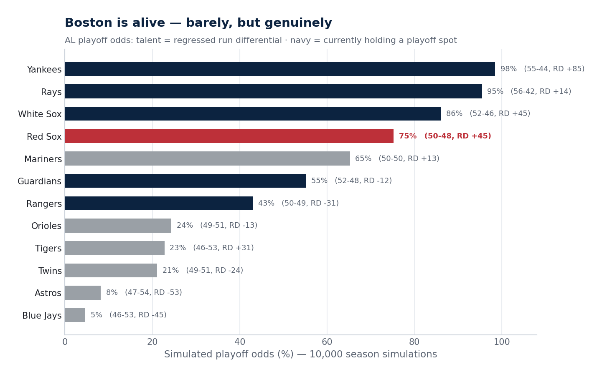
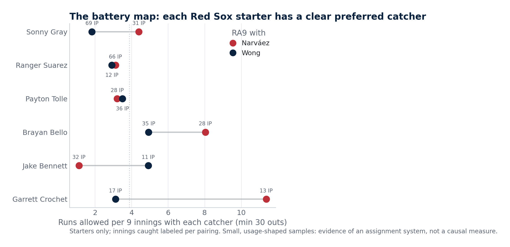
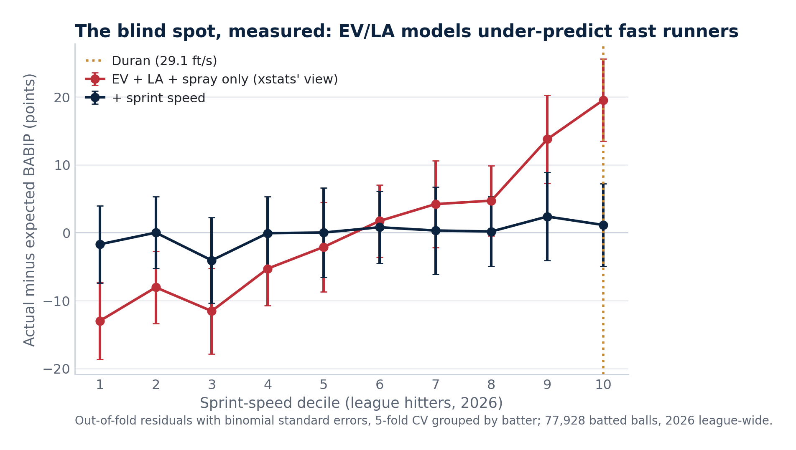
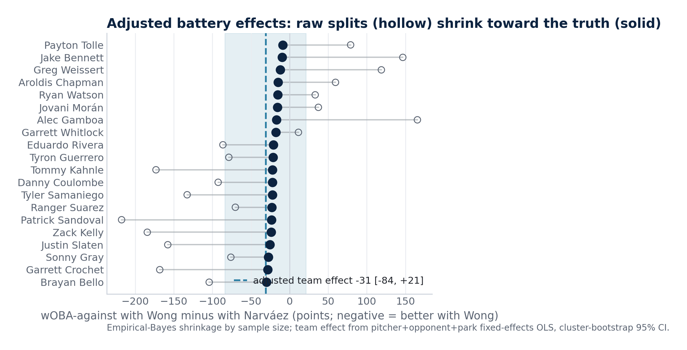

# Red Sox Trade Deadline 2026, by the Numbers

[](https://github.com/justinloo12/jarren-duran-outlier-analysis/actions/workflows/tests.yml)

**Read it live:**
[project site](https://justinloo12.github.io/jarren-duran-outlier-analysis/) ·
[the deadline article](https://justinloo12.github.io/jarren-duran-outlier-analysis/deadline.html) ·
[the Duran long-read](https://justinloo12.github.io/jarren-duran-outlier-analysis/outputs/duran_case.html)

A reproducible baseball-analytics case study of the 2026 Red Sox trade
deadline — built on live data, custom models, and pre-registered
predictions that get graded whether they age well or not.

It started as a single question (*was Jarren Duran's 2024 All-Star season
a fluke?*) and grew into a full front-office exercise: a buy/sell verdict,
a positional audit, value-checked mock trades, a catcher-battery study,
and a deadline plan whose organizing rule is that a winning clubhouse is
an asset you don't disturb.

**The short version.** Boston's record spent three months lagging a +45
run differential; a 10,000-run simulation puts their playoff odds around
75%. Verdict: buy, but small — one reliever for prospects, maybe a rental
infield bat, and nothing that touches the working roster. Duran's slump
is the team's biggest positional hole and heals on its own: his wOBA sits
*below* his xwOBA, which is doubly anomalous for one of the fastest men
in baseball. And the catcher "upgrade" the raw audit demands dies on
contact with the pitching data — there is no catcher problem to fix.

| | |
|---|---|
|  |  |
|  |  |

## Quick start

```bash
pip install -r requirements.txt

python run_all.py              # full run: pull data -> models -> figures -> article
python run_all.py --no-fetch   # reuse cached data, just re-analyze
python run_all.py --fetch-only # only refresh raw data

python -m unittest discover tests   # offline unit tests (also run in CI)
python deck/make_dark_figs.py && python deck/build_deck.py   # presentation deck
```

Everything regenerates from source on each run — the article's verdict,
odds, and race language all branch on the live standings, so the prose
updates its own argument when the games do. Outputs land in `data/`
(CSV/JSON/parquet), `figures/` (18 charts + dark deck variants), and
`outputs/` (the article, seven memos, a 19-slide deck, and the frozen
predictions file).

## Two models built for this project

**1. A speed-aware expected-contact model** ([`src/xcontact.py`](src/xcontact.py)).
Statcast xstats are built from exit velocity and launch angle, so they
systematically shortchange fast runners — a claim this project first
handled with an offset and then tested properly by training the corrected
model. Gradient boosting on ~75,000 league-wide 2026 batted balls (EV,
launch angle, spray), fit twice: once blind to sprint speed, once with
it. Validation is 5-fold CV **grouped by batter**, so every residual is
out-of-sample at the player level. The speed-blind model under-predicts
the fastest decile of hitters by ~18 points of BABIP (figure 16), and
Duran's speed term is worth ~13 points of wOBA on contact — landing
inside the +5-to-14-point band the analysis had derived independently
from his career wOBA−xwOBA gaps. One honest wrinkle, reported rather
than hidden: overall AUC barely moves, because EV/LA dominate globally.
Sprint speed fixes a *player-level bias*, not global discrimination.

**2. An adjusted catcher-battery model** ([`src/battery_model.py`](src/battery_model.py)).
Raw catcher splits (staff RA9 with Wong vs. Narváez, per-pitcher battery
RA9 — [`src/battery.py`](src/battery.py), figure 14) look dramatic and
are badly confounded: who catches whom is a choice. Three treatments at
the plate-appearance level, wOBA-against as the outcome:
*with-or-without-you* deltas pooled across the 14 pitchers both catchers
caught; fixed-effects OLS (pitcher + opponent + park controls) with a
cluster bootstrap by game for the CI; and empirical-Bayes shrinkage of
each pairing split by its reliability. The result reversed the headline:
the eye-catching raw pairings (a 1.12 RA9 here, a 1.86 there) mostly
shrink to noise, and the overall catcher effect is statistically
indistinguishable from zero (figure 15). The trade recommendation
changed accordingly — the model killed a trade the raw data had
justified, which is the point of building the model.

## The rest of the analytical stack

- **Luck decomposition with a corrected baseline** — luck measured
  against Duran's *own* career wOBA−xwOBA gap rather than zero, because
  a burner beats his xstats as a skill ([`src/analysis.py`](src/analysis.py)).
- **A 2016–25 backtest of that assumption** — among 322 hitters sitting
  ≥20 points under their xwOBA at midseason, mean second-half recovery
  was +19 points, and rest-of-season wOBA tracks midseason xwOBA (r=.445)
  better than midseason wOBA (r=.365)
  ([`src/luck_backtest.py`](src/luck_backtest.py)).
- **A rebound Monte Carlo** — recency-weighted true-talent prior,
  effective-sample-size standard errors, a talent-drift term, and an
  empirical wOBA→wRC+ conversion with a park offset; run under a healthy
  prior and an erosion scenario, because the gap between them *is* the
  answer ([`src/rebound_sim.py`](src/rebound_sim.py)).
- **A physical-vs-approach erosion decomposition** — Statcast bat
  tracking as the tiebreaker: his bat speed is *up* (72.7 → 74.5 mph),
  so the 2026 whiff/chase leak reads as approach, not body
  ([`src/erosion.py`](src/erosion.py)).
- **Park checks** — his career overperformance is +19 points at Fenway
  and +19 on the road; it travels.
- **A playoff-odds simulation, positional audit, and $8M/WAR + prospect-FV
  trade framework** feeding four value-checked mock trades and one
  deliberate walk-away ([`src/deadline.py`](src/deadline.py),
  [`src/mock_trades.py`](src/mock_trades.py)).
- **An overvalue audit** — the roster's thin-track-record contributors
  measured against their own careers (career-best flags, results vs
  contact quality), plus a data check on the real deadline trade
  ([`src/aaaa.py`](src/aaaa.py), [`src/acquisition.py`](src/acquisition.py)).
- **Pre-registered, falsifiable predictions** — frozen 2026-07-04 in
  [`outputs/predictions.json`](outputs/predictions.json) with quantile
  bands and probability calls, plus a grader
  ([`src/grade_predictions.py`](src/grade_predictions.py)) that scores
  everything in October (Brier + interval coverage), flattering or not.

## Deliverables

- [`outputs/ARTICLE.md`](outputs/ARTICLE.md) — the post-ready piece; all
  numbers generated live
- [`outputs/Red_Sox_Trade_Deadline.pptx`](outputs/Red_Sox_Trade_Deadline.pptx)
  — 19-slide deck, dark broadcast theme, stats wired to the data files
- [`outputs/decision_memo.md`](outputs/decision_memo.md),
  [`outputs/mock_trades.md`](outputs/mock_trades.md),
  [`outputs/deadline_decision.md`](outputs/deadline_decision.md) and
  three more memos — the full paper trail
- `outputs/duran_case.html` — self-contained web write-up

## Method notes / honesty caveats

- **Battery splits are usage-confounded** and the write-up says so
  everywhere they appear; the adjusted model is the load-bearing
  estimate, and its CI crosses zero.
- **~A dozen significance tests** are reported without family-wise
  correction; isolated p≈.03–.05 results are treated as directional.
- **The aging curve** uses the delta method, which biases toward smaller
  declines — a deliberately conservative benchmark.
- **Salaries** are hand-verified (Spotrac/reporting) with as-of dates;
  unverified figures are omitted, not guessed.
- **The chemistry constraint is an assumption, not a measurement** — the
  deadline plan prices clubhouse disruption as a cost and is explicit
  that this input is judgment layered on the value math.
- Season context: this is a live 2026 analysis; numbers refresh on every
  pipeline run and the prose adapts to the standings.

## Layout

```
src/
  config.py            # player id, seasons, paths
  fetch_*.py           # FanGraphs JSON API, Statcast, MLB Stats API, MiLB
  statcast_metrics.py  # season process metrics from pitch data (+ SEs)
  analysis.py          # outlier tests, luck baselines, park checks
  age_curve.py         # empirical delta-method aging curve
  comps.py             # peer/salary comparison
  outfield_plan.py     # surplus-value model + roster plan
  trade_targets.py     # trade value + fit-ranked partners
  deadline.py          # odds sim, positional audit, ARTICLE.md
  mock_trades.py       # value-checked mock trades + the walk-away
  battery.py           # raw catcher-battery splits (fig 14)
  battery_model.py     # WOWY + fixed-effects + shrinkage (fig 15)
  xcontact.py          # speed-aware expected-contact GBMs (fig 16)
  rebound_sim.py       # rebound Monte Carlo
  erosion.py           # bat-tracking physical-vs-approach decomposition
  luck_backtest.py     # 2016-25 luck-gap backtest
  preregister.py       # freezes predictions.json
  grade_predictions.py # October grader (Brier + coverage)
  viz.py  memo.py  web_deck.py  style.py
run_all.py             # orchestrator
deck/                  # dark-theme figure variants + pptx builder
tests/                 # offline unit tests (run in CI on every push)
data/  figures/  outputs/
```

### Figures

01 BABIP vs league · 02 wOBA vs xwOBA · 03 plate discipline ·
04 age curve · 05–06 peer/salary comps · 07 outfield plan ·
08 trade fits · 09 rebound simulation · 10 erosion decomposition ·
11 luck-gap backtest · 12 playoff race · 13 positional audit ·
14 battery map · 15 adjusted battery effects · 16 speed-model residuals

*Data: Baseball Savant via [pybaseball](https://github.com/jldbc/pybaseball),
the FanGraphs JSON API, and the MLB Stats API. For research/education.*
