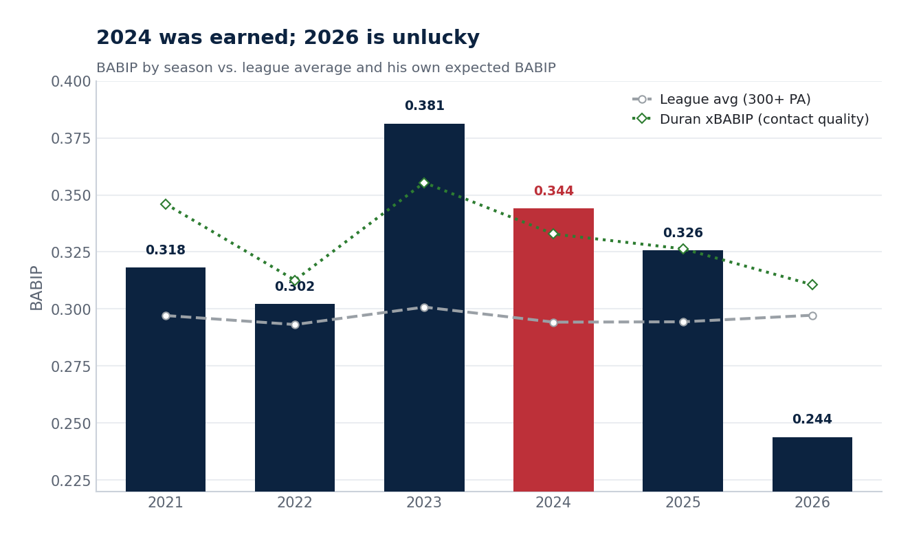
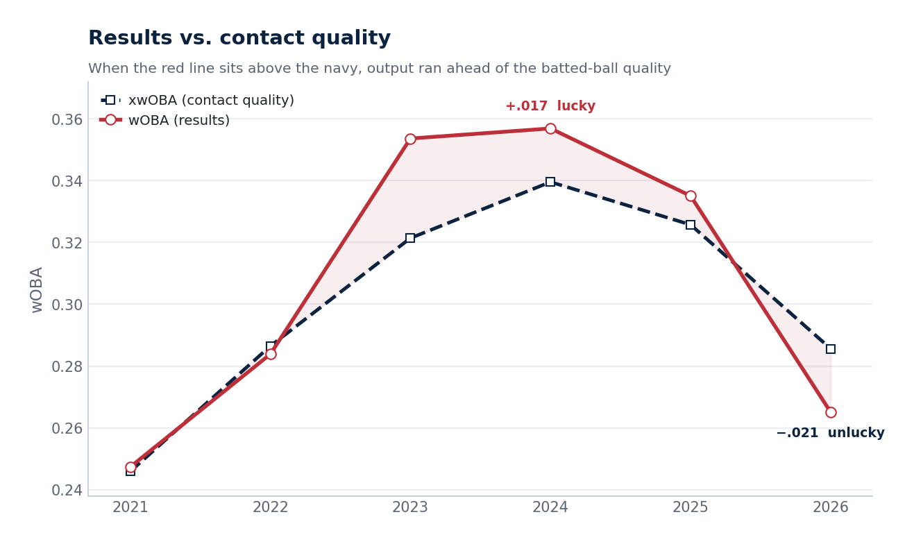
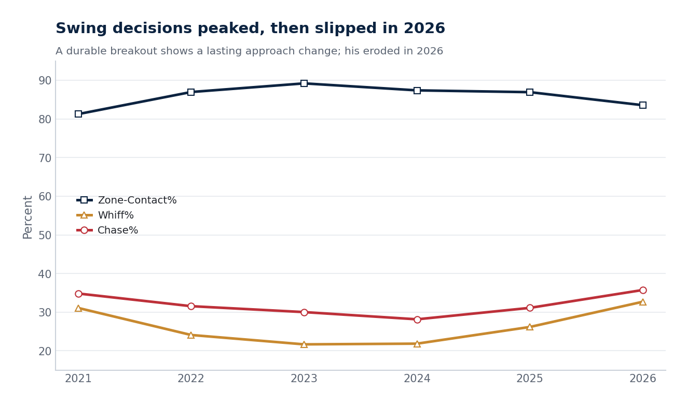
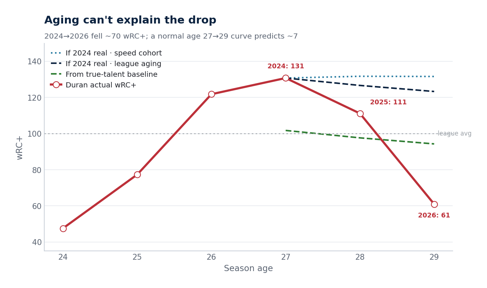
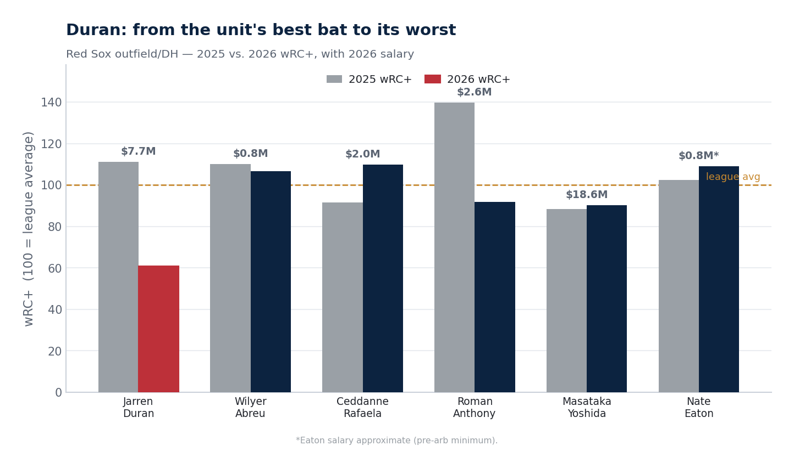
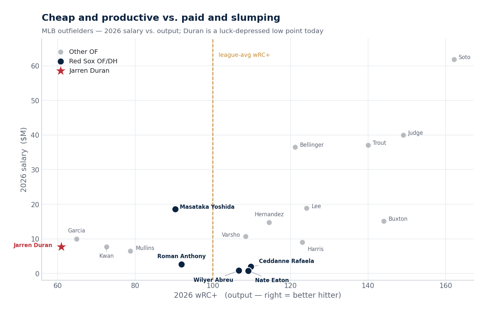
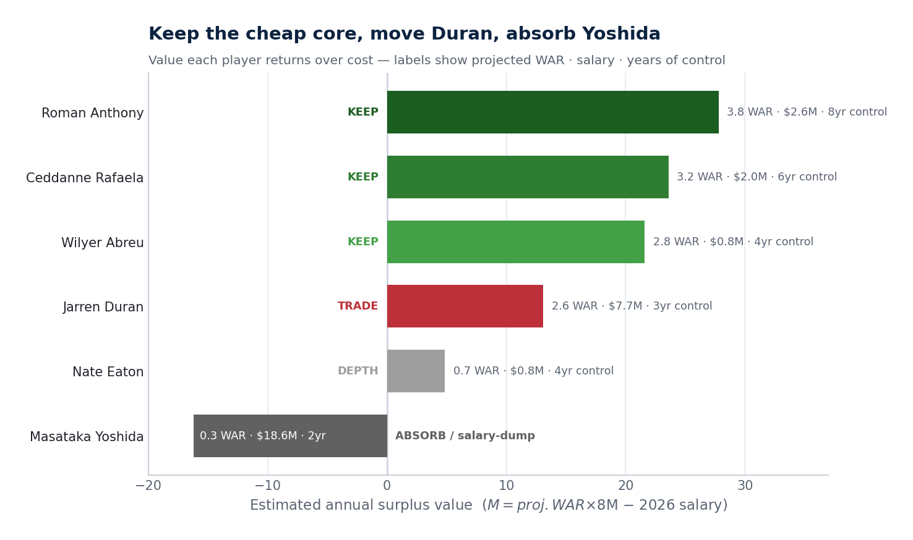
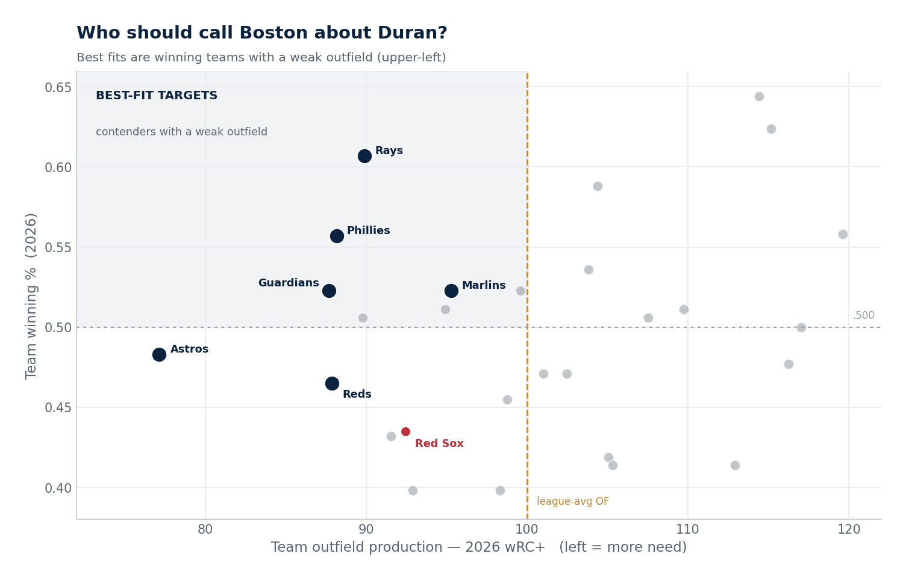

# Jarren Duran & the Red Sox Outfield — Graphics & Explanations

A visual summary of the analysis. Headline: Duran's 2024 was his genuine peak (only modestly luck-aided), his true talent is an above-average regular (~110 wRC+, his 2025 level), and his ugly 2026 is partly **unlucky** — bad batted-ball luck stacked on smaller, real skill erosion. For the team, the outfield is a **surplus** while the pitching is a **strength** (top-10 rotation) — so the move is to trade the redundant bat (Duran), from a position of depth and after a value rebound, for young hitting/position talent, and to absorb the Yoshida contract.

## 1 · BABIP by season vs. league average

How often Duran's balls in play fell for hits each year (bars), versus the league average (grey line) and versus what his own contact quality 'deserved' (green, xBABIP). **2024's .344 sits close to his xBABIP (.333) — largely earned, not lucky.** The real outlier is 2026: a .244 mark far below the .311 his contact supports — bad luck stacked on a smaller, real decline.

## 2 · Results vs. contact quality (wOBA vs. xwOBA)

Actual offensive output (red) against what his contact quality predicts (navy). One key adjustment: these expected stats ignore sprint speed, and a burner like Duran *always* beats them a little (~+6 points in his other seasons) by legging out hits. Against his own norm, **2024's gap (+17 raw) is only ~+11 points of true luck — modest**, and smaller than 2023's. In 2026 the lines flip: his results run *below* his contact quality (−27 vs. his norm) — for a speedster, a strong sign of bad luck, not just lost skill.

## 3 · Swing decisions & contact

Chase% (swings at balls outside the zone), whiff%, and zone-contact% over time — the 'approach' metrics. A durable breakout shows a lasting improvement here. **Duran's discipline was best in 2023–24 and held in 2025, then clearly eroded in 2026** (more chasing, more swinging through pitches) — the one genuine warning sign in his profile.

## 4 · Age-curve overlay

His actual wRC+ by age (red) against what normal aging predicts from his 2024 peak (blue/navy) and from his true-talent baseline (green). His 2026 falls far below *every* aging path. **Aging explains only ~7 of the ~70-point drop** — the rest is regression from a lucky peak plus a 2026 down-tail, not a normal age decline.

## 5 · Red Sox outfield — 2025 vs. 2026, with salary

Each Red Sox outfielder/DH's wRC+ in 2025 (grey) and 2026 (navy), with 2026 salary labeled. **Duran (red) fell from the unit's best bat to its worst regular — while carrying its second-highest salary ($7.7M).** Cheaper, younger Abreu and Rafaela now out-produce him; Yoshida ($18.6M) is the expensive underperformer.

## 6 · Salary vs. output across MLB outfielders

Every notable outfielder plotted by 2026 salary (up) and output (right = better hitter). **Duran sits low-output, mid-salary today** — a poor value point, but only because 2026 is a luck-depressed partial season. Yoshida is the pricier bust; the cheap Red Sox kids (Abreu, Rafaela) are among the best values on the board.

## 7 · Outfield surplus value — keep / trade / absorb

Estimated annual value each player provides over what he costs (projected WAR × $8M − salary). **The young core (Anthony, Rafaela, Abreu) are huge positives → keep.** Duran is a smaller positive and redundant → trade. Yoshida is deeply negative → absorb or salary-dump.

## 8 · Best-fit trade partners

Teams plotted by winning % (up) and outfield production (right = stronger OF). **The best trade partners for Duran are winning teams with weak outfields (upper-left): Phillies, Rays, Marlins, Guardians** — contenders who would pay in young talent for an everyday outfielder. (Boston, having a top-10 rotation, should take back bats, not arms.)
