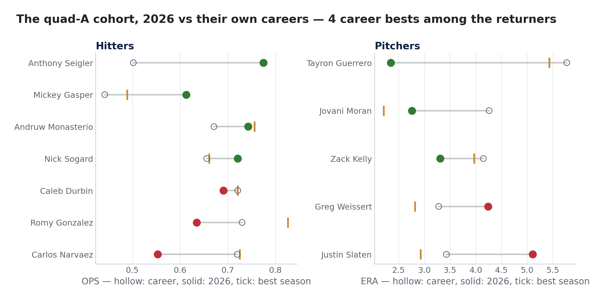

# The Quad-A Audit — the surge's supporting cast, vs their own careers

*Cohort: 2026 Red Sox with a real role (40+ PA / 15+ IP) and a thin MLB track record entering the year (hitters < 1,000 career PA, pitchers < 250 career IP, age 24+). Career baselines from MLB StatsAPI year-by-year; process checks from pitch-level Statcast.*

**Headline:** 15 players fit the profile. Together they account for **+3.4 WAR** in 2026. Of the 11 with prior MLB seasons, **4 are running career bests**, and the other 4 are rookies with no MLB baseline at all. Depth like this is why the surge happened; counting on it to repeat is how deadline mistakes get made.

**The base rate (2016-2025):** 100 hitters and 198 relievers matched this profile with a career-best first half. The median kept 39% of the surge; 34% of hitters and 37% of relievers fell back to career level in the second half. Full design in `src/aaaa_backtest.py`, figure 20.

## Hitters

| Player | Age | 2026 PA | wRC+ | OPS | Career OPS | Best (yr) | wOBA−xwOBA | Career high? |
|---|---:|---:|---:|---:|---:|---:|---:|:--|
| Anthony Seigler | 27 | 115 | 112 | 0.775 | 0.502 | rookie season | -7 | first MLB season |
| Mickey Gasper | 30 | 119 | 70 | 0.613 | 0.442 | 0.489 (2025) | +6 | **YES** |
| Andruw Monasterio | 29 | 187 | 101 | 0.743 | 0.671 | 0.756 (2025) | +17 | no |
| Nick Sogard | 28 | 41 | 102 | 0.721 | 0.656 | 0.661 (2025) | +24 | **YES** |
| Tsung-Che Cheng | 24 | 44 | 68 | 0.600 | — | rookie season | -27 | first MLB season |
| Caleb Durbin | 26 | 353 | 89 | 0.691 | 0.721 | 0.721 (2025) | +28 | no |
| Romy Gonzalez | 29 | 60 | 74 | 0.635 | 0.73 | 0.826 (2025) | -22 | no |
| Carlos Narvaez | 27 | 182 | 51 | 0.553 | 0.72 | 0.725 (2025) | -12 | no |

## Pitchers

| Player | Age | 2026 IP | ERA | FIP | Career ERA | Best (yr) | xwOBA−wOBA against | Career best? |
|---|---:|---:|---:|---:|---:|---:|---:|:--|
| Tayron Guerrero | 35 | 23.0 | 2.35 | 2.32 | 5.77 | 5.43 (2018) | -35 | **YES** |
| Jovani Moran | 29 | 42.1 | 2.76 | 3.84 | 4.26 | 2.21 (2022) | +5 | no |
| Zack Kelly | 31 | 16.1 | 3.31 | 3.66 | 4.15 | 3.97 (2024) | +83 | **YES** |
| Tyler Samaniego | 27 | 20.1 | 2.66 | 3.55 | — | rookie season | -4 | first MLB season |
| Ryan Watson | 28 | 52.2 | 4.44 | 4.74 | — | rookie season | +39 | first MLB season |
| Greg Weissert | 31 | 40.1 | 4.24 | 4.57 | 3.28 | 2.82 (2025) | -18 | no |
| Justin Slaten | 28 | 24.2 | 5.11 | 3.27 | 3.43 | 2.93 (2024) | -80 | no |

*Positive wOBA−xwOBA = results ahead of contact quality (regression risk). For pitchers, positive xwOBA−wOBA against = allowing weaker results than the contact deserves (same risk, run-prevention side).*

