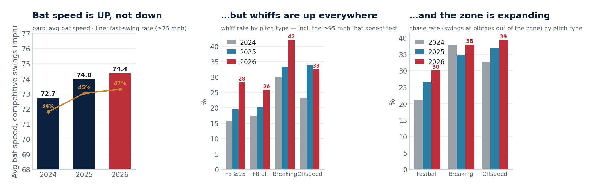

# Erosion Decomposition — Physical or Approach?

*Generated 2026-07-23 · pitch-level Statcast, regular season only, bat tracking 2024+ · methodology in `src/erosion.py`.*

## The tiebreaker: bat speed is UP

| Season | Avg bat speed (mph) | Fast-swing % (≥75) | P90 (mph) | Swing length (ft) | Attack angle (°) | Tracked swings |
|--------|--------------------:|-------------------:|----------:|------------------:|-----------------:|---------------:|
| 2024 | 72.72 | 33.9% | 78.9 | 7.47 | 3.2 | 1228 |
| 2025 | 73.95 | 44.7% | 79.6 | 7.39 | 4.9 | 1174 |
| 2026 | 74.36 | 47.1% | 79.5 | 7.51 | 5.5 | 705 |

**Duran's 2026 bat speed (74.36 mph) is +1.02 mph versus his 2024–25 average** (73.34), and his fast-swing rate has climbed 34% → 45% → 47%. A physically declining hitter swings *slower*; Duran is swinging harder, longer (7.47 → 7.51 ft) and steeper (3.2° → 5.5°). Whatever 2026 is, it is not a slowing bat.

## Where the whiffs and chases actually live

| Cut | 2024 | 2025 | 2026 |
|-----|-----:|-----:|-----:|
| Whiff% overall | 21.8% | 26.2% | 31.8% |
| Whiff% vs fastballs ≥95 | 15.8% | 19.5% | 28.3% |
| Whiff% vs fastballs | 17.3% | 20.1% | 25.9% |
| Whiff% vs breaking | 29.9% | 33.3% | 42.1% |
| Whiff% vs offspeed | 23.2% | 34.0% | 32.6% |
| Chase% overall | 28.1% | 31.1% | 34.4% |
| Chase% vs fastballs | 21.2% | 26.6% | 30.1% |
| Chase% vs breaking | 37.8% | 34.7% | 38.0% |
| Chase% vs offspeed | 32.7% | 36.9% | 39.4% |
| Chase% breaking, down-and-away | 47.1% | 38.4% | 33.3% |
| Swing% in the 'chase' attack zone | 25.6% | 29.1% | 38.4% |
| In-zone contact% | 87.4% | 86.9% | 84.0% |

Three honest observations:

1. **The whiff spike is everywhere, including premium velocity** (≥95 FB: 15.8% → 19.5% → 28.3%, n=166 swings in 2026). On its own that reads like a slowing bat — but the bat is *measured* and it is not slowing. Rising whiffs on a rising bat speed + a longer, steeper swing is the signature of **selling out**: more intent, less bat control.
2. **The chase leak is velocity and offspeed, not the classic breaking-ball-in-the-dirt.** Chase on fastballs jumped 21.2% → 30.1% and on offspeed 32.7% → 39.4%, while chase on breaking balls down-and-away has actually *improved* (47.1% → 33.3%, small n). He is not getting fooled by spin; he is starting the A-swing early and expanding off velocity — an approach/timing problem.
3. **In-zone contact is down** (87.4% → 84.0%) — the cost of the max-intent swing showing up even on hittable pitches.

## Verdict

**This is an approach problem, not a physical one — and the bat speed is the receipt.** The one direct physical measurement got *better* (+1.0 mph vs 2024–25) while every decision metric got worse (chase +3.3 pts vs 2025, in-zone contact -2.9 pts). Duran at 29 is not losing bat speed; he appears to be pressing — swinging harder, longer and steeper, expanding against velocity and offspeed. Approach problems are fixable (his own 2022→2023 chase overhaul is the in-house proof); bat-death is not. **This re-weights the rebound scenarios toward the healthy prior.**

Quantified: weighting the scenarios 60/40 (vs an agnostic 50/50) puts the blended P(rest-of-season wRC+ ≥ 100) at **57%** (vs 56% agnostic; the pure scenarios are 64% healthy / 47% eroded).

One caveat, stated plainly: 'approach' does not mean 'automatically fixed.' The fix requires him (or the hitting group) to actually dial the intent back, and half a season of habit is real. But the asset a trade partner is pricing — bat speed, foot speed, defense — is intact, which strengthens the case that today's $10M nadir price sells the slump, not the player.

---
*Definitions: competitive swings ≥50 mph bat speed; fast swing ≥75 mph (Savant thresholds). Pitch groups: FB=FF/SI/FC, BRK=SL/ST/SV/CU/KC/CS/SC, OFF=CH/FS/FO/EP/KN. Attack zones normalized to the batter's own strike zone (heart ≤2/3, shadow ≤4/3, chase ≤2, waste beyond). 2026 is a half season — the by-pitch-type cells run n≈100–350, so read cell-level moves as directional; the bat-speed trend itself is measured on 600+ swings per season.*