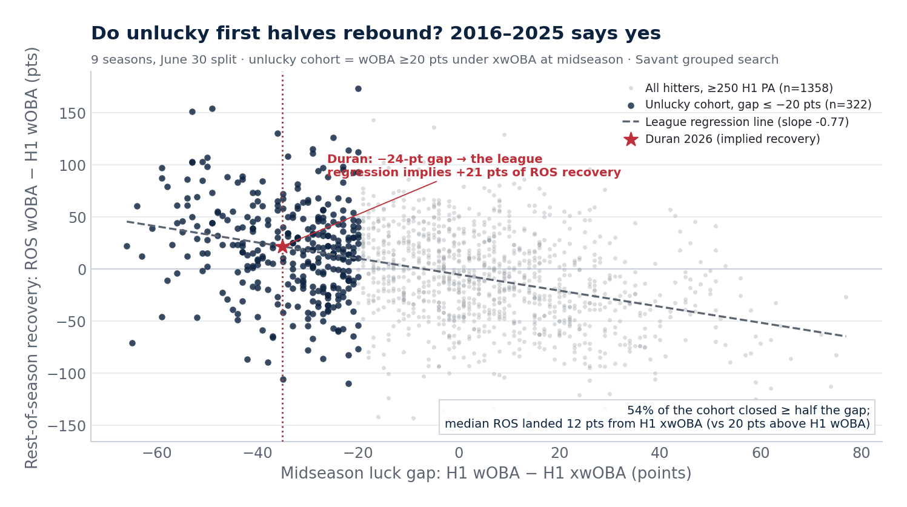

# Luck-Gap Backtest — Does the X-Stat Win? (2016–2025)

*Generated 2026-07-23 · Savant grouped search, June 30 split, seasons 2016, 2017, 2018, 2019, 2021, 2022, 2023, 2024, 2025 · methodology in `src/luck_backtest.py`.*

## The test

The rebound model assumes a first-half wOBA sitting well below xwOBA is partly luck that regresses. Historical cohort: every hitter with ≥250 PA by June 30 whose wOBA sat ≥20 points below his xwOBA (n = **322** player-seasons across 9 seasons), graded on his rest-of-season (≥100 PA).

## The result: history sides with the x-stat

| Quantity | Value |
|----------|------:|
| Mean ROS recovery (ROS wOBA − H1 wOBA) | **+19 pts** |
| Median ROS recovery | +20 pts |
| Mean ROS wOBA − H1 **x**wOBA | -14 pts |
| Median ROS wOBA − H1 xwOBA | -12 pts |
| Closed ≥ half the gap | **54%** |
| Any improvement at all | 68% |
| corr(ROS wOBA, H1 xwOBA) — cohort | 0.453 |
| corr(ROS wOBA, H1 wOBA) — cohort | 0.443 |
| corr(ROS wOBA, H1 xwOBA) — all hitters (n=1358) | **0.445** |
| corr(ROS wOBA, H1 wOBA) — all hitters | 0.365 |

**The x-stat wins the horse race.** Across all 1358 qualified first halves, midseason xwOBA predicts the rest of the season better than midseason wOBA (0.445 vs 0.365), and the same ordering holds inside the unlucky cohort.

The recovery direction is unambiguous either way: the average unlucky-cohort hitter improved by **+19 points of wOBA** after June 30 and landed within 12 points of his midseason *xwOBA* (median), i.e. the second half tracked the process stat, not the unlucky results. 54% closed at least half the gap.

## Where Duran sits

Duran's 2026 midseason gap is **-35 points** (wOBA 0.260 vs xwOBA 0.295) — more negative than **91%** of all 1358 qualified first halves since 2016 (roughly the 9th percentile of the gap distribution). Within the unlucky cohort itself he sits at the 37th percentile — a typical member, not an outlier even among the unlucky. Applying the cohort's mean recovery to his line implies a ROS wOBA around **0.279** — well above the .263 he would be sold on today, but short of both Monte Carlo medians (.318 eroded / .336 healthy). That is the right reading: the backtest regresses the luck *around whatever the current process is*, and his 2026 xwOBA is itself depressed and speed-blind. The backtest validates the sim's mechanism and direction; the talent level comes from the priors, not from this cohort.

## What this does to the rebound memo

- The 69% healthy-prior scenario **gains external validity**: its core mechanism (second halves track xwOBA, not unlucky wOBA) is what actually happened in 54% of comparable cases.
- It does **not** validate the healthy prior's *level* — the backtest regresses the luck gap, and Duran's 2026 xwOBA (.287) is itself depressed. The erosion scenario's question (is the process worse?) is answered by the bat-tracking decomposition, not by this cohort.
- Net: the two documents together say *the direction is up, the destination depends on the approach fix* — which is exactly how the pre-registered predictions are framed.

---
*Caveats: survivor bias (hitters must log 100+ second-half PA to be graded — badly slumping players get benched, which likely flatters the recovery numbers modestly); the June 30 split is calendar-based, not PA-balanced; xwOBA from the Savant grouped search is park- and speed-blind, which for a burner like Duran makes the implied recovery conservative.*