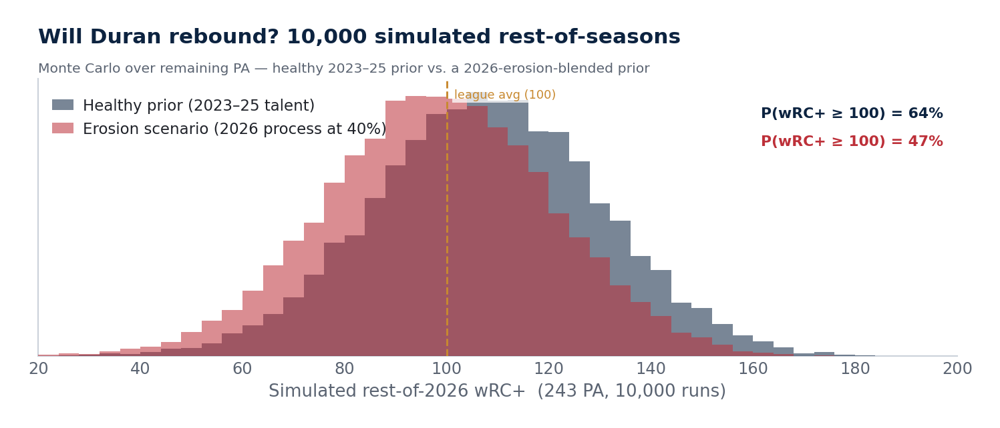

# Rebound Probability — Monte Carlo on the Rest of 2026

*Generated 2026-07-23 · 10,000 sims, seed 680776 (deterministic) · remaining PA = 243 (61 Red Sox games left × his 403-PA-in-101-games pace).*

## The model in one paragraph

True talent is drawn from a prior built on 2023–25 xwOBA (weighted by PA × 3/4/5 recency) **plus his speed premium** (+2 pts, his own career wOBA−xwOBA gap — Statcast xstats ignore sprint speed), giving a healthy-prior mean of **0.333 wOBA ≈ 108 wRC+** — independent confirmation of the memo's ~110 wRC+ plateau. Talent uncertainty (σ = 15 pts) combines the prior's estimation error with year-to-year drift; each sim then adds binomial-approximation sampling noise (√(p(1−p)/n) ≈ 30 pts at 243 PA). wOBA→wRC+ uses a PA-weighted league fit plus Duran's own park offset (-2.3).

## Two scenarios — the gap IS the erosion question

The healthy prior assumes **no injury and no true skill cliff**. But the decision memo documents real 2026 erosion (chase, whiff, hard-hit all significantly worse). The erosion scenario blends 2026's own degraded process (xwOBA 0.295) into the prior at **40%** weight.

| Quantity | Healthy prior | Erosion-blended |
|----------|--------------:|----------------:|
| True-talent prior (wOBA / wRC+) | 0.333 / 108 | 0.318 / 99 |
| P(rest-of-season wRC+ ≥ 100) | **64%** | **47%** |
| P(rest-of-season wRC+ ≥ 110) | 46% | 30% |
| P(full-season 2026 wRC+ ≥ 90) | 7% | 3% |
| Median rest-of-season (wOBA / wRC+) | 0.332 / 108 | 0.318 / 98 |
| Median full-season 2026 (wOBA / wRC+) | 0.287 / 78 | 0.282 / 74 |

## What the gap says

- If the 2023–25 player is intact, a league-average-or-better rest of season is roughly a **64%** proposition — a favorable bet, i.e. the 'hold, he'll rebound' case.
- If the 2026 process erosion is ~40% real, that drops to **47%** — a coin flip whose median rest-of-season (98 wRC+) is only league-average. The ~17-point probability gap is the price of the eroded chase/whiff/hard-hit rates.
- **Either way, the full-season 2026 line stays ugly**: even the healthy prior gives only 7% odds of finishing above 90 wRC+ (median ≈ 78). The first-half hole is too deep — so a buyer looking at the season line will still see a down year, which matters for timing below.

## Valuation timing under the rebound distribution

Anchors from the trade-value model ($8M/WAR): sell-at-the-nadir ≈ **$10M** (≈45-FV return), sell-after-rebound ≈ **$28M** (≈50-FV). Expected value = P(rebound) × rebound value + (1−P) × nadir; the deadline row gives a mid-rebound buyer only half credit. Illustrative, not a market model.

| Timing | Healthy prior | Erosion-blended |
|--------|--------------:|----------------:|
| Sell now (July) | $10M | $10M |
| Sell at the deadline | $15M | $14M |
| Sell in the offseason | $21M | $18M |

## Does this support the standing recommendation?

**Yes — with one honest caveat.** Waiting dominates selling now in *both* scenarios: the offseason expectation beats the July nadir by ~$12M under the healthy prior and still by ~$9M even if the erosion is 40% real, because the downside of waiting is roughly the nadir you'd get today anyway. So the hold-through-2026 / deal-in-the-offseason call survives the erosion stress test. The caveat: the erosion scenario cuts the rebound probability to about a coin flip and shaves the expected offseason return, so the *confidence* in the rebound narrative should be lower than the decision memo's luck framing alone implies — and a further slide in chase/whiff would argue for taking a good deadline offer rather than maximizing.

---
*Assumptions: no injury; PA pace holds; the prior ignores any mid-season swing changes. The normal approximation to wOBA sampling error and the FV/$ anchors are documented simplifications. Rerun `python3 run_all.py --no-fetch` to refresh after new games.*